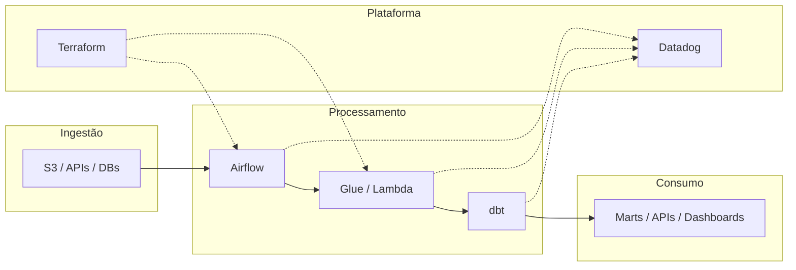

# 01 — Contexto, princípios e objetivos

> **Versão:** 1.0 · **Escopo:** squads de dados e backend · **Modelo:** multi-repo · **Observabilidade:** Datadog

---

## Sumário

1. [Objetivo](#1-objetivo)
2. [Público-alvo](#2-público-alvo)
3. [Problemas que endereçamos](#3-problemas-que-endereçamos)
4. [Contexto organizacional](#4-contexto-organizacional)
5. [Princípios de engenharia](#5-princípios-de-engenharia)
6. [Objetivos mensuráveis](#6-objetivos-mensuráveis)
7. [Decisões estratégicas](#7-decisões-estratégicas)
8. [Trade-offs](#8-trade-offs)
9. [Quando aplicar / quando não aplicar](#9-quando-aplicar--quando-não-aplicar)
10. [Estrutura de entrega](#10-estrutura-de-entrega)
11. [Convenções globais](#11-convenções-globais)
12. [Práticas obrigatórias e recomendadas](#12-práticas-obrigatórias-e-recomendadas)
13. [Anti-padrões organizacionais](#13-anti-padrões-organizacionais)
14. [Exemplos — bom vs. ruim](#14-exemplos--bom-vs-ruim)
15. [Estratégias transversais](#15-estratégias-transversais)
16. [Checklists](#16-checklists)
17. [Critérios de aceite](#17-critérios-de-aceite)
18. [Definition of Done](#18-definition-of-done)
19. [FAQ](#19-faq)
20. [Guia júnior](#20-guia-júnior)
21. [Guia sênior](#21-guia-sênior)

---

## 1. Objetivo

Estabelecer **contexto compartilhado**, **princípios não negociáveis** e **objetivos mensuráveis** para engenharia de dados e backend no ecossistema `{nome-projeto}`.

Este capítulo responde:

- **Por que** padronizamos (e não apenas "como").
- **O que** consideramos qualidade, segurança e operabilidade.
- **Como** squads diferentes colaboram em ambiente **multi-repo** sem monorepo corporativo.

Não substitui OKRs de produto nem roadmap — define o **chão técnico** sobre o qual features são construídas.

---

## 2. Público-alvo

| Público | Uso principal |
|---------|---------------|
| Engenharia (dados e backend) | Alinhar decisões diárias aos princípios |
| Liderança técnica | Avaliar exceções e investimento em plataforma |
| Arquitetura | Validar aderência e propor ADRs |
| Operação / SRE | Entender metas de SLO e observabilidade |
| Terceiros | Contrato técnico de entrega |
| Segurança / compliance | Referência para revisões e auditoria |

Leitura obrigatória na [trilha essencial](00-como-usar-este-handbook.md#91-trilha-essencial-primeira-semana), antes de qualquer capítulo de stack.

---

## 3. Problemas que endereçamos

### 3.1 Fragmentação técnica

Múltiplos times entregam pipelines, APIs e infra em paralelo. Sem princípios comuns:

- Incidentes demoram mais (logs incompatíveis, sem `correlation_id`).
- Onboarding leva semanas.
- Refactors custam caro (cada repo é um dialecto).

### 3.2 Fronteira dados ↔ backend borrada

Dados viram produto (marts, APIs analíticas, eventos). Backend consome e produz dados. Precisamos de **contratos** e **responsabilidades** claras — ver [02-arquitetura-transversal.md](02-arquitetura-transversal.md).

### 3.3 Operação reativa

Pipelines sem métrica, alerta sem runbook, deploy sem rollback documentado. Padronizamos **observabilidade no Datadog** desde o desenho — [13-observabilidade.md](13-observabilidade.md).

### 3.4 Qualidade superficial

"Cobertura de linha" com testes que não assertam comportamento; PR aprovado sem validar contrato downstream. Metas: **90% cobertura**, **90% mutation** onde aplicável, **TaaC** em integrações — [10](10-testes-unitarios.md), [11](11-taac-testes-integrados-na-pipeline.md), [12](12-testes-de-mutacao.md).

### 3.5 Risco de dados e conformidade

PII em log, bucket público por engano, IAM excessivo. [17-seguranca-conformidade-e-dados-sensiveis.md](17-seguranca-conformidade-e-dados-sensiveis.md) traduz princípios em prática.

---

## 4. Contexto organizacional

### 4.1 Stacks no escopo

| Stack | Papel típico em `{nome-projeto}` |
|-------|----------------------------------|
| **Airflow** | Orquestração de cargas, dependências, SLAs |
| **dbt** | Transformação, qualidade e documentação analítica |
| **Terraform** | Infraestrutura AWS como código |
| **Lambda (Python)** | Eventos, integrações leves, validações |
| **Java Spring Boot** | APIs transacionais, serviços de domínio |
| **AWS Glue** | ETL/ELT distribuído, volumes altos |

### 4.2 Modelo multi-repo

Cada componente de produção vive em **repositório dedicado**:

```
{nome-projeto}-airflow
{nome-projeto}-dbt
{nome-projeto}-infra
{nome-projeto}-lambda-{funcao}
{nome-projeto}-glue-{job}
{nome-projeto}-api-{servico}
```

O repositório `repositorio-de-padroes` (este handbook) **não contém código de produção** — apenas padrões, templates e exemplos de referência.

### 4.3 Fluxo de valor simplificado



### 4.4 Papéis e responsabilidades (RACI simplificado)

| Atividade | Squad dono do componente | Plataforma / SRE | Arquitetura |
|-----------|--------------------------|------------------|-------------|
| Código e testes | **R** | C | I |
| Infra Terraform | **R** | C | A |
| Monitors Datadog | **R** | A | I |
| Padrão handbook | C | I | **A** |
| Incidente P1 | **R** | **R** | I |
| ADR cross-cutting | C | I | **A** |

*R = Responsible, A = Accountable, C = Consulted, I = Informed*

---

## 5. Princípios de engenharia

Princípios **ordenados por prioridade** em conflito (ex.: segurança > velocidade de entrega pontual).

### P1 — Separação de responsabilidades

Negócio, orquestração, infraestrutura e integração são camadas distintas. Regra de negócio **não** mora em DAG, handler, controller gordo ou módulo Terraform.

→ Detalhes: [02-arquitetura-transversal.md](02-arquitetura-transversal.md), [03-padroes-de-codigo.md](03-padroes-de-codigo.md)

### P2 — Contratos explícitos entre repositórios

Paths S3, schemas, ARNs, eventos e SLAs documentados. Breaking change exige comunicação + versionamento.

### P3 — Idempotência e reprocessamento seguro

Mesma entrada + mesmo contexto ⇒ mesmo efeito observável. Backfill e retry são cenários de primeira classe — não edge cases.

### P4 — Falhar cedo, falhar visível

Validação na borda; erros tipados; nada de swallow silencioso. Operador deve saber **o que** falhou e **onde** olhar no Datadog.

### P5 — Observabilidade by design

Todo fluxo crítico: logs JSON, métricas de sucesso/erro/duração/volume, `correlation_id` propagado, alerta com runbook.

→ [13-observabilidade.md](13-observabilidade.md)

### P6 — Testabilidade e qualidade verificável

Domínio testável sem cloud; cobertura ≥ 90%; mutation em regras críticas; TaaC quando há integração real.

### P7 — Segurança e privacidade por padrão

Least privilege IAM; secrets fora do código; sem PII em log; dados sensíveis classificados.

→ [17-seguranca-conformidade-e-dados-sensiveis.md](17-seguranca-conformidade-e-dados-sensiveis.md)

### P8 — Performance e custo conscientes

Volume, particionamento e custo AWS avaliados **antes** da implementação final.

→ [14-performance.md](14-performance.md)

### P9 — Documentação mínima útil

README por componente, ADR para decisões, dicionário para marts críticos — não documentação ornamental.

→ [15-documentacao.md](15-documentacao.md)

### P10 — Melhoria contínua versionada

Mudança de padrão via PR no handbook; retro de incidente alimenta runbook e capítulos.

---

## 6. Objetivos mensuráveis

Metas de **direção** — cada squad adapta ao contexto com baseline no onboarding.

| Objetivo | Meta | Medição |
|----------|------|---------|
| Cobertura de testes | ≥ 90% em código novo | CI (coverage report) |
| Mutation score | ≥ 90% em domain/application | CI mutation tool |
| Tempo de detecção (MTTD) | < 15 min fluxos críticos | Datadog monitors |
| PR com DoD completa | ≥ 95% | Auditoria de template PR |
| Incidentes sem runbook | Tendência a zero | Post-mortem |
| Freshness dados críticos | Conforme SLA documentado | dbt source freshness + métricas |
| Deploy rollback | Documentado e testado | Runbook / game day |
| Onboarding até 1º PR | ≤ 5 dias úteis | Survey + [20-onboarding-tecnico.md](20-onboarding-tecnico.md) |

---

## 7. Decisões estratégicas

| ID | Decisão | Status | Notas |
|----|---------|--------|-------|
| D1 | Multi-repo por componente | Adotado | Sem monorepo corporativo |
| D2 | Datadog como plataforma única de observabilidade | Adotado | Logs, APM, RUM se aplicável, SLO |
| D3 | AWS como cloud principal | Adotado | Terraform para IaC |
| D4 | Python para Lambda e Glue; Java para APIs transacionais | Adotado | Exceção via ADR |
| D5 | Airflow para orquestração batch | Adotado | Datasets para dependências entre DAGs |
| D6 | dbt para camada analítica transformada | Adotado | Staging → marts |
| D7 | Handbook em PT-BR; identificadores internos em português | Adotado | Legibilidade do time e consistência |
| D8 | Placeholder `{nome-projeto}` em exemplos | Adotado | Evita acoplamento a produto único |
| D9 | DoD unificada | Adotado | [18-definition-of-done.md](18-definition-of-done.md) |
| D10 | IA assistiva com revisão humana obrigatória | Adotado | [19-padroes-para-uso-de-ia.md](19-padroes-para-uso-de-ia.md) |

Decisões locais de serviço → ADR no repo `{nome-projeto}-*` usando [templates/adr.md](templates/adr.md).

---

## 8. Trade-offs

### 8.1 Velocidade vs. padronização

| | Velocidade máxima | Padronização |
|---|-------------------|--------------|
| **Curto prazo** | Menos leitura, copy-paste | Mais leitura inicial |
| **6+ meses** | Dívida, incidentes, refactor | Manutenção previsível |
| **Recomendação** | Padronizar desde o componente 1 | |

**Exceção controlada:** spike ≤ 2 dias — DoD reduzida, débito no PR, issue de convergência.

### 8.2 Acoplamento vs. autonomia de squad

Multi-repo **aumenta** autonomia de deploy e **exige** contratos melhores. Alternativa monorepo centralizaria build mas dilui ownership.

### 8.3 Cobertura 90% vs. tempo de entrega

90% não é vanity metric quando combinado com mutation e TaaC. Exceção por módulo deve ser **justificada no PR** (ex.: boilerplate gerado, código de config).

### 8.4 Observabilidade completa vs. custo Datadog

Indexing agressivo de logs custa caro. Usar sampling em debug, retenção por ambiente, e métricas para agregação — detalhes em [13-observabilidade.md](13-observabilidade.md).

### 8.5 Documentação extensa vs. atualização

Handbook longo mas versionado > wiki curta e obsoleta. Trilhas de leitura em [00-como-usar-este-handbook.md](00-como-usar-este-handbook.md) mitigam sobrecarga.

---

## 9. Quando aplicar / quando não aplicar

### Aplicar estes princípios quando

- Código em repositório `{nome-projeto}-*` com deploy em dev/staging/prod
- Integração entre squads (dados consumindo API, API publicando evento)
- Fluxo com SLA ou impacto financeiro/regulatório
- Onboarding de novo membro ou terceiro
- Pós-incidente para prevenir recorrência

### Não aplicar integralmente quando

- **PoC descartável** sem path para produção — marcar explicitamente
- **Script one-off** de migração com vida < 1 semana — segurança mínima ainda vale
- **Stack fora do escopo** (ex.: app mobile nativa) — não force padrão Spring Boot
- **Emergência P0** — corrigir primeiro; convergir ao padrão em PR de follow-up em 48h

---

## 10. Estrutura de entrega

### 10.1 Repositórios

| Tipo | Nome | Conteúdo |
|------|------|----------|
| Handbook | `repositorio-de-padroes` | Capítulos 00–20, templates |
| Orquestração | `{nome-projeto}-airflow` | DAGs, plugins, testes |
| Transformação | `{nome-projeto}-dbt` | models, macros, snapshots |
| Infra | `{nome-projeto}-infra` | Terraform, módulos |
| Compute leve | `{nome-projeto}-lambda-*` | Python, domain, tests |
| Compute pesado | `{nome-projeto}-glue-*` | PySpark jobs |
| API | `{nome-projeto}-api-*` | Spring Boot |

### 10.2 Artefatos por feature

| Tamanho | Artefatos |
|---------|-----------|
| Pequena | PR + testes + logs |
| Média | + README atualizado + monitor se crítico |
| Grande | + [plano-de-implementacao.md](templates/plano-de-implementacao.md) + ADR se decisão nova |

### 10.3 Ambientes

| Ambiente | Propósito | Paridade |
|----------|-----------|----------|
| `dev` | Desenvolvimento individual | Estrutura similar, escala menor |
| `staging` | Validação integrada, TaaC | Dados mascarados/sintéticos |
| `prod` | Operação | SLAs e alertas completos |

---

## 11. Convenções globais

| Tópico | Convenção |
|--------|-----------|
| Idioma prosa | Português BR |
| Código | Português para identificadores internos; inglês para contratos/SDKs/tags técnicas |
| Projeto | `{nome-projeto}` em exemplos |
| Branch | `feature/`, `fix/`, `docs/` + ticket |
| Commit | Imperativo, referência ticket: `feat(dbt): add fct_pedidos` |
| PR | Template [pr.md](templates/pr.md) |
| Tag Datadog | `env`, `service`, `team`, `version` |
| Segredos | AWS Secrets Manager / SSM — nunca git |

---

## 12. Práticas obrigatórias e recomendadas

### Obrigatórias

1. Aderir à [Definition of Done](18-definition-of-done.md) em todo PR de produção.
2. Propagar `correlation_id` em fluxos multi-componente.
3. Classificar dados sensíveis antes de persistir ou logar.
4. Testes automatizados no CI — merge bloqueado se vermelho.
5. Code review por par antes de merge — [16-code-review.md](16-code-review.md).
6. Infra via Terraform — sem clickops em prod.
7. Um repositório por PR de código (evitar PR que cruza airflow + dbt + infra sem coordenação).

### Recomendadas

1. Game day de rollback uma vez por semestre em fluxo crítico.
2. Post-mortem blameless com ação em doc/runbook.
3. Pair programming em mudança de contrato cross-repo.
4. Dashboard executivo por domínio de negócio no Datadog.
5. Revisão trimestral de custo AWS por `{nome-projeto}`.

---

## 13. Anti-padrões organizacionais

| Anti-padrão | Impacto | Correção |
|-------------|---------|----------|
| "Cada squad faz do seu jeito" | Incidentes e onboarding | Handbook + review |
| Hero culture (só Fulano sabe) | Bus factor | README + runbook + pair |
| Deploy na sexta sem monitor | Fim de semana ruim | Política de change + Datadog |
| PII em Slack "para debug" | Compliance | Ferramentas mascaradas, [17](17-seguranca-conformidade-e-dados-sensiveis.md) |
| Ignorar staging | Bug em prod | TaaC em staging |
| PR gigante multi-repo | Review superficial | Dividir por contrato |
| Métrica sem dono | Alerta ignorado | Owner no README e no monitor |
| Teste que só executa | Falsa segurança | Mutation + asserts de comportamento |

---

## 14. Exemplos — bom vs. ruim

### 14.1 Comunicação de breaking change

**Ruim:**

> "Mudei o path do S3, aviso depois."

**Bom:**

> PR em `{nome-projeto}-infra` com output documentado; issue linked nos repos `{nome-projeto}-airflow` e `{nome-projeto}-dbt`; ADR curta; data de corte em staging antes de prod.

### 14.2 Definição de pronto

**Ruim:**

> "Subiu em prod, fechamos o card."

**Bom:**

> DoD [18](18-definition-of-done.md): testes, monitor Datadog, runbook, README, freshness dbt verde, sem débito não rastreado.

### 14.3 Observabilidade

**Ruim:**

```python
print(f"processou {len(rows)} linhas")  # stdout não estruturado, sem correlation_id
```

**Bom:**

```python
logger.info(
    "batch_processed",
    extra={
        "correlation_id": ctx.correlation_id,
        "record_count": len(rows),
        "status": "SUCCESS",
        "duration_ms": elapsed_ms,
    },
)
```

Métrica Datadog `{{nome_projeto}}.batch.records_processed` incrementada no mesmo ponto.

### 14.4 Multi-repo

**Ruim:** Um PR alterando DAG, model dbt e módulo Terraform — review impossível, rollback acoplado.

**Bom:** Três PRs ordenados: (1) infra com output novo, (2) dbt consumindo path, (3) Airflow com sensor no path — cada um com testes e deploy independente.

---

## 15. Estratégias transversais

### 15.1 Testes

| Camada | Estratégia | Referência |
|--------|------------|------------|
| Domínio | Unit puro, mutation | [10](10-testes-unitarios.md), [12](12-testes-de-mutacao.md) |
| Integração | TaaC em CI staging | [11](11-taac-testes-integrados-na-pipeline.md) |
| Dados | dbt tests + freshness | [05](05-dbt.md) |
| Orquestração | Testes estruturais DAG | [04](04-airflow.md) |

### 15.2 Observabilidade (Datadog)

- **Logs:** JSON, campos obrigatórios, sem PII
- **Métricas:** negócio + técnica
- **Traces:** APM em APIs e Lambdas críticas
- **SLOs:** fluxos com SLA de negócio
- **Monitors:** sintoma + runbook URL

### 15.3 Performance

Estimar volume (linhas/dia, GB, RPS) no card; validar em staging com perfil representativo; revisar custo mensal pós-deploy.

### 15.4 Segurança

Threat modeling leve em features com dados pessoais; scan de secrets no CI; revisão IAM em todo PR Terraform.

### 15.5 Documentação

Toda entrega média/grande atualiza README; decisão irreversível gera ADR; mart consumido por BI externo tem dicionário.

---

## 16. Checklists

### 16.1 Checklist — início de projeto / épico

- [ ] Repositório(s) `{nome-projeto}-*` criados com README template
- [ ] Owners definidos (código, operação, dados)
- [ ] Contratos S3/schema/API esboçados
- [ ] Ambientes dev/staging/prod provisionados via Terraform
- [ ] Service Datadog criado com tags padrão
- [ ] SLAs acordados com negócio
- [ ] Capítulos de stack lidos pelo time

### 16.2 Checklist — review de aderência aos princípios

- [ ] P1 separação de camadas respeitada?
- [ ] P2 contrato cross-repo atualizado?
- [ ] P3 idempotência documentada?
- [ ] P5 logs/métricas Datadog?
- [ ] P6 cobertura e testes de comportamento?
- [ ] P7 sem secrets/PII no diff?
- [ ] DoD [18](18-definition-of-done.md) satisfeita?

### 16.3 Checklist — operação (meta organizacional)

- [ ] Todo fluxo crítico tem runbook
- [ ] Escalonamento documentado
- [ ] Post-mortem template usado após P1/P2
- [ ] Métricas de negócio visíveis para product

---

## 17. Critérios de aceite

Consideramos o contexto organizacional **alinhado** quando:

- [ ] Squads conhecem lista de repos `{nome-projeto}-*` e owners
- [ ] Novos membros completam trilha essencial em ≤ 5 dias úteis
- [ ] Incidentes P1 geram ação em doc ou código em ≤ 2 sprints
- [ ] ≥ 95% PRs de produção referenciam DoD
- [ ] Datadog usado como fonte única de verdade operacional para fluxos no escopo
- [ ] Exceções têm ADR ou registro no PR

---

## 18. Definition of Done

DoD detalhada: [18-definition-of-done.md](18-definition-of-done.md).

**Resumo executivo dos princípios neste capítulo:**

| Item | Requisito mínimo |
|------|------------------|
| Código | Mergeado, revisado, testes verdes |
| Observabilidade | Logs JSON + métricas; alerta se crítico |
| Segurança | Sem secrets; IAM mínimo |
| Documentação | README ou PR description suficiente |
| Contratos | Downstream informado se breaking |
| Operação | Runbook se novo monitor high+ |

---

## 19. FAQ

**P: Por que multi-repo e não monorepo?**  
R: Ownership claro, deploy independente, blast radius menor. Custo: contratos explícitos.

**P: 90% cobertura não é arbitrário?**  
R: É piso para código novo; mutation e TaaC complementam. Exceções justificadas.

**P: Somos obrigados a usar Datadog?**  
R: É padrão corporativo para `{nome-projeto}`. Exceção = ADR + plano.

**P: Como entra terceiro no modelo?**  
R: Acesso aos repos `{nome-projeto}-*`, leitura do handbook, DoD igual ao time interno.

**P: Princípios mudam com frequência?**  
R: Princípios (P1–P10) mudam raramente; práticas nos capítulos 04–09 evoluem via PR.

**P: O que fazer se produto pressiona por skip de teste?**  
R: Registrar risco no PR, débito com data, aprovação de tech lead; não merge silencioso.

---

## 20. Guia júnior

### O que memorizar primeiro

1. **Onde** fica seu código (`{nome-projeto}-dbt`, etc.).
2. **Princípios P1, P3, P5** — camadas, idempotência, logs.
3. **DoD** antes de pedir review.

### Perguntas para fazer ao mentor

- Qual o `correlation_id` padrão no nosso Airflow?
- Onde vejo monitors Datadog do meu serviço?
- Qual mart downstream depende do que estou alterando?

### Sinais de que está no caminho certo

- Seu teste quebra quando a regra de negócio muda
- Você sabe explicar o fluxo em 2 minutos sem abrir código
- Seu PR cabe em uma tela de diff

---

## 21. Guia sênior

### Liderança técnica

- Traduzir princípios em decisões concretas no board (não só no review).
- Bloquear merge que viola P7 (segurança) ou P2 (contrato) sem plano.
- Investir em templates e exemplos — multiplica o handbook.

### Calibrar exceções

Use matriz:

| Impacto | Exceção permitida | Registro |
|---------|-------------------|----------|
| Baixo, temporário | DoD reduzida | PR + issue |
| Médio | Spike timeboxed | ADR leve |
| Alto | Não sem plano | ADR + aprovação arquitetura |

### Métricas que o sênior acompanha

- Lead time vs. taxa de incidente pós-deploy
- % PRs com rollback
- Custo AWS por domínio
- Freshness e qualidade dbt em marts críticos

---

*Anterior:* [00 — Como usar este handbook](00-como-usar-este-handbook.md) · *Próximo:* [02 — Arquitetura transversal](02-arquitetura-transversal.md)
