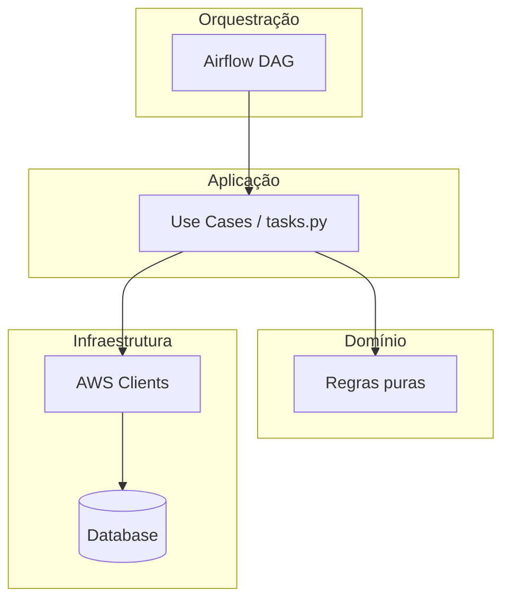

# 02 — Arquitetura transversal

> **Versão:** 1.0 · **Modelo:** multi-repo · **Observabilidade:** Datadog · **Placeholder:** `{nome-projeto}`

---

## Sumário

1. [Objetivo](#1-objetivo)
2. [Público-alvo](#2-público-alvo)
3. [Problemas arquiteturais comuns](#3-problemas-arquiteturais-comuns)
4. [Princípios arquiteturais](#4-princípios-arquiteturais)
5. [Decisões de arquitetura](#5-decisões-de-arquitetura)
6. [Trade-offs](#6-trade-offs)
7. [Quando usar / não usar](#7-quando-usar--não-usar)
8. [Modelo de camadas](#8-modelo-de-camadas)
9. [Arquitetura multi-repo](#9-arquitetura-multi-repo)
10. [Contratos entre componentes](#10-contratos-entre-componentes)
11. [Fluxos de referência](#11-fluxos-de-referência)
12. [Convenções](#12-convenções)
13. [Práticas obrigatórias e recomendadas](#13-práticas-obrigatórias-e-recomendadas)
14. [Anti-padrões](#14-anti-padrões)
15. [Exemplos bom / ruim](#15-exemplos-bom--ruim)
16. [Estrutura de pastas por repo](#16-estrutura-de-pastas-por-repo)
17. [Código de referência](#17-código-de-referência)
18. [Estratégias transversais](#18-estratégias-transversais)
19. [Checklists](#19-checklists)
20. [Critérios de aceite](#20-critérios-de-aceite)
21. [Definition of Done](#21-definition-of-done)
22. [FAQ](#22-faq)
23. [Guia júnior](#23-guia-júnior)
24. [Guia sênior](#24-guia-sênior)

---

## 1. Objetivo

Definir a **arquitetura transversal** do ecossistema `{nome-projeto}`: como camadas de domínio, aplicação, infraestrutura e orquestração se relacionam em ambiente **multi-repo**, quais **contratos** unem repositórios distintos e como **observabilidade Datadog** atravessa o fluxo ponta a ponta.

Este capítulo não substitui capítulos de stack ([04](04-airflow.md)–[09](09-aws-glue.md)) — estabelece o **esqueleto** que todos devem respeitar.

---

## 2. Público-alvo

| Perfil | Uso |
|--------|-----|
| Desenvolvedores | Saber onde colocar cada tipo de lógica |
| Arquitetos / tech leads | Validar fronteiras e contratos |
| Revisores | Detectar violação de camada em PR |
| SRE | Entender dependências para incidentes |
| Analytics / produto | Entender origem e SLA dos dados |

---

## 3. Problemas arquiteturais comuns

| Problema | Sintoma | Custo |
|----------|---------|-------|
| **God component** | DAG de 800 linhas com SQL e HTTP | Impossível testar; incidente opaco |
| **Monorepo disfarçado** | Pasta `airflow/` e `dbt/` no mesmo repo sem fronteira | Deploy acoplado; ownership confuso |
| **Contrato implícito** | Path S3 "todo mundo sabe" | Quebra silenciosa em refactor |
| **Orquestração com negócio** | Regra de desconto dentro de `@task` | Duplicação em Glue e API |
| **Observabilidade em silo** | Log sem `correlation_id` entre Lambda e dbt | MTTR alto |
| **Infra no application code** | ARN hardcoded em Python | Ambiente não reproduzível |

---

## 4. Princípios arquiteturais

### A1 — Camadas com dependência unidirecional

```
Orquestração → Aplicação → Domínio
Infraestrutura implementa portas da Aplicação
```

Domínio **não importa** Airflow, boto3, Spring, Spark, Terraform.

### A2 — Um repositório, um propósito operacional

Deploy, rollback e ownership alinhados ao componente (DAG, mart, API, job Glue).

### A3 — Integração apenas por contrato versionado

S3 paths, schemas, eventos, OpenAPI, outputs Terraform — documentados e revisáveis.

### A4 — Idempotência em toda escrita

Partição por `data_referencia`, `unique_key` dbt, chaves naturais em APIs.

### A5 — Falha isolada

Erro em uma task não corrompe dados downstream sem detecção; sensores e testes dbt bloqueiam propagação.

### A6 — Observabilidade como nervo transversal

`correlation_id` nasce no Airflow (ou API gateway) e percorre Lambda, Glue, dbt vars e logs Datadog.

---

## 5. Decisões de arquitetura

| ID | Decisão | Alternativa | Motivo da escolha |
|----|---------|-------------|-------------------|
| ARQ-01 | Multi-repo | Monorepo | Times autônomos, blast radius |
| ARQ-02 | Airflow orquestra, não transforma volume | Tudo no Airflow | Escala e custo |
| ARQ-03 | dbt dono da camada analítica SQL | SQL solto no Glue | Testes, lineage, docs |
| ARQ-04 | Glue para volume PySpark | Lambda pesado | Timeout e memória |
| ARQ-05 | Lambda para eventos leves | ECS para tudo | Custo e simplicidade |
| ARQ-06 | Spring Boot para transacional | Lambda API | Maturidade ecossistema |
| ARQ-07 | Terraform único por `{nome-projeto}-infra` ou domínio | TF espalhado em app repos | State e IAM centralizados |
| ARQ-08 | Datadog para correlação cross-service | Logs CloudWatch isolados | Uma UI para incidente |

Decisões que contradizem esta tabela exigem [ADR](templates/adr.md).

---

## 6. Trade-offs

### 6.1 Multi-repo vs. monorepo

| Critério | Multi-repo | Monorepo |
|----------|------------|----------|
| Deploy independente | ✅ | ⚠️ exige tooling |
| Contratos explícitos | Obrigatório | Pode relaxar |
| Refactor cross-cutting | Coordenação | Um PR |
| Ownership | Claro por repo | Pode diluir |

**Escolha:** multi-repo para `{nome-projeto}`.

### 6.2 Síncrono vs. assíncrono entre componentes

| | Síncrono (HTTP) | Assíncrono (S3 + sensor / evento) |
|---|-----------------|-----------------------------------|
| Acoplamento temporal | Alto | Baixo |
| Complexidade operacional | Menor | Sensores, atrasos |
| Uso | APIs, validações rápidas | Cargas batch, arquivos |

### 6.3 Transformação no Glue vs. dbt

| Glue | dbt |
|------|-----|
| Volume bruto, semi-estruturado | Camada limpa em warehouse |
| PySpark complexo | SQL declarativo, testes |
| Custo de cluster | Custo de warehouse |

**Padrão:** Glue normaliza e landa; dbt modela staging → marts.

---

## 7. Quando usar / não usar

### Aplicar este modelo quando

- Novo domínio de dados ou API em `{nome-projeto}`
- Integração entre ≥ 2 repos
- Definição de SLA ponta a ponta
- Refatoração que move lógica entre camadas

### Flexibilizar (com ADR) quando

- Latência ultra-baixa exige monólito temporário
- Ferramenta legada não suporta camadas (wrapper até migração)
- Volume minúsculo onde serverless único basta

---

## 8. Modelo de camadas

| Camada | Responsabilidade | Onde vive | Pode importar |
|--------|------------------|-----------|---------------|
| **Domínio** | Regras de negócio puras | `domain/`, `*.domain` |stdlib, tipos puros |
| **Aplicação** | Casos de uso, orquestração local | `application/`, `service/` | Domínio |
| **Infraestrutura** | AWS, DB, HTTP, filas | `infrastructure/`, `adapter/` | Aplicação, domínio (DTO) |
| **Orquestração** | Schedule, dependências, retry | DAG Airflow, Step Functions | Aplicação via módulos |
| **Integração** | Contratos na borda | OpenAPI, `sources.yml`, schemas | — |
| **IaC** | Recursos cloud | `{nome-projeto}-infra` | — |

### Diagrama de dependências



---

## 9. Arquitetura multi-repo

### 9.1 Mapa de repositórios

```
repositorio-de-padroes/                    # Handbook (não produção)
{nome-projeto}-infra/           # Terraform, IAM, buckets, triggers
{nome-projeto}-airflow/         # DAGs
{nome-projeto}-glue-{job}/      # Jobs PySpark
{nome-projeto}-lambda-{fn}/     # Funções event-driven
{nome-projeto}-dbt/             # Transformação analítica
{nome-projeto}-api-{svc}/       # Spring Boot
```

### 9.2 Matriz de dependências

| De ↓ / Para → | infra | airflow | glue | lambda | dbt | api |
|---------------|-------|---------|------|--------|-----|-----|
| **infra** | — | outputs | outputs | outputs | — | outputs |
| **airflow** | vars | — | trigger | invoke | cosmos/bash | — |
| **glue** | IAM | — | — | — | escreve staging | — |
| **lambda** | IAM | evento | — | — | — | HTTP |
| **dbt** | — | schedule | lê tabelas | — | refs | — |
| **api** | secrets | — | — | async | lê marts | — |

**Regra:** dependência de código fonte entre repos é **proibida**; apenas contratos de runtime.

### 9.3 Ordem de deploy em mudança cross-repo

1. **infra** — recursos e outputs novos
2. **glue/lambda** — produtores de dados
3. **dbt** — consome staging atualizado
4. **airflow** — sensores/Datasets apontando para artefatos existentes
5. **api** — consome marts ou eventos estáveis

---

## 10. Contratos entre componentes

### 10.1 Contrato de objeto (S3)

Documentar no README de `{nome-projeto}-infra` e `{nome-projeto}-airflow`:

```yaml
# Contrato: arquivo vendas diário
bucket: "{nome-projeto}-landing-{env}"
prefix: "vendas/pedidos/dt={data_referencia}/"
format: parquet
schema_version: "v2"
producer: "{nome-projeto}-glue-carga-vendas"
consumers:
  - "{nome-projeto}-dbt (stg_vendas__pedidos)"
  - "{nome-projeto}-airflow (sensor)"
sla_availability: "04:00 UTC"
```

### 10.2 Contrato de tabela (warehouse)

Em `{nome-projeto}-dbt/sources.yml` + dicionário [15-documentacao.md](15-documentacao.md).

### 10.3 Contrato de API

OpenAPI em `{nome-projeto}-api-*`; versionamento `/v1/`; breaking change = nova versão ou deprecation header.

### 10.4 Contrato de evento

JSON Schema em `docs/schemas/` do produtor; campos obrigatórios: `event_id`, `occurred_at`, `correlation_id`, `payload`.

### 10.5 Contrato de observabilidade

| Campo | Obrigatório em todos os serviços |
|-------|----------------------------------|
| `correlation_id` | Sim |
| `service` | `{nome-projeto}-{componente}` |
| `env` | dev/staging/prod |
| `operation` | Nome estável da operação |

Ver [13-observabilidade.md](13-observabilidade.md).

---

## 11. Fluxos de referência

### 11.1 Carga batch diária (padrão)

```
Schedule Airflow
  → Sensor S3 / Dataset
  → Glue job (raw → staging tables / parquet)
  → dbt build (staging → marts)
  → Testes dbt + freshness
  → Métrica Datadog "carga_ok"
```

### 11.2 Evento em tempo quase real

```
API ou S3 event
  → Lambda valida + enriquece
  → Grava fila ou staging
  → (opcional) DAG incremental horária consolida
```

### 11.3 Provisionamento

```
PR {nome-projeto}-infra
  → terraform plan/apply
  → Outputs atualizados
  → PRs consumidores ajustam variáveis
```

---

## 12. Convenções

### 12.1 Naming AWS

`{nome-projeto}-{dominio}-{tipo}-{env}`

Exemplos:

- `datalake-vendas-landing-prod`
- `datalake-pedidos-glue-role-staging`

### 12.2 Tags obrigatórias (recursos Terraform)

```hcl
tags = {
  project     = "{nome-projeto}"
  environment = var.environment
  team        = var.team
  managed_by  = "terraform"
  cost_center = var.cost_center
}
```

### 12.3 `correlation_id`

| Origem | Geração |
|--------|---------|
| Airflow | `run_id` ou `dag_run.conf["correlation_id"]` |
| API | Header `X-Correlation-Id` ou UUID no gateway |
| Lambda S3 | `request_id` + `object_key` hash se necessário |

Propagar via `dag_run.conf`, env vars Glue, `--vars` dbt, MDC em Spring.

---

## 13. Práticas obrigatórias e recomendadas

### Obrigatórias

1. README em todo repo com diagrama simples e owners
2. Contrato atualizado no mesmo épico que muda path/schema
3. Domínio sem dependência de framework cloud
4. `correlation_id` em logs de ponta a ponta
5. IAM least privilege via Terraform
6. PR único por repo salvo coordenação explícita em issue mestra

### Recomendadas

1. Airflow Datasets para dependências entre DAGs
2. dbt exposures para lineage até dashboard
3. Diagrama C4 nível container no README do domínio
4. Contract testing entre API e consumidor
5. Feature flags para rollout de schema

---

## 14. Anti-padrões

| Anti-padrão | Camada violada | Correção |
|-------------|----------------|----------|
| SQL de mart na DAG | Orquestração | Mover para dbt |
| boto3 no domain | Domínio | Adapter infra |
| Terraform em repo de DAG | IaC misturado | `{nome-projeto}-infra` |
| Glue escrevendo mart final | Transformação duplicada | dbt único dono |
| API lendo S3 raw | Bypass de contrato | Mart ou API dedicada |
| Shared library git submodule entre 5 repos | Acoplamento | Publicar pacote versionado ou duplicar thin adapter |
| Log texto livre | Observabilidade | JSON Datadog |

---

## 15. Exemplos bom / ruim

### 15.1 Fronteira Airflow ↔ negócio

**Ruim — regra na DAG:**

```python
@task
def calcular_desconto(pedidos):
    return [p for p in pedidos if p["valor"] > 100 and p["vip"]]  # regra de negócio
```

**Bom — módulo testável:**

```python
# include/app/vendas/domain/desconto.py
def elegivel_desconto_vip(pedido: Pedido) -> bool:
    return pedido.valor > Decimal("100") and pedido.cliente.vip

# include/app/vendas/tasks.py
@task
def aplicar_descontos(pedidos: list[dict]) -> list[dict]:
    parsed = [Pedido.from_dict(p) for p in pedidos]
    return [p.to_dict() for p in parsed if elegivel_desconto_vip(p)]
```

### 15.2 Contrato S3

**Ruim:** Renomear pasta `dt=` sem avisar dbt.

**Bom:** ADR + versão `schema_version` + período dual-write ou backfill documentado.

### 15.3 Cross-repo PR

**Ruim:** Um PR com TF + dbt + airflow.

**Bom:** Issue com checklist; 3 PRs linkados; ordem de merge definida.

---

## 16. Estrutura de pastas por repo

### `{nome-projeto}-api-{servico}`

```
src/main/java/com/{nomeprojeto}/{servico}/
├── domain/
├── application/
├── adapter/in/web/
├── adapter/out/persistence/
└── config/
src/test/
docs/adr/
```

### `{nome-projeto}-lambda-{funcao}`

```
src/
├── handler.py
├── domain/
├── application/
└── infrastructure/
tests/unit|integration/
```

### `{nome-projeto}-airflow`

```
dags/{nome-projeto}_{dominio}_{fluxo}.py
plugins/app/operators/
include/app/{dag}/tasks.py|config.yaml
tests/dags/|tests/unit/
```

### `{nome-projeto}-dbt`

```
models/staging|intermediate|marts/
macros/ tests/ snapshots/
```

### `{nome-projeto}-glue-{job}`

```
src/job.py
src/transforms/
src/infrastructure/
tests/
```

### `{nome-projeto}-infra`

```
envs/dev|staging|prod/
modules/{capability}/
```

---

## 17. Código de referência

### 17.1 Propagação de contexto (Airflow → Glue)

```python
# include/app/vendas/tasks.py
def build_glue_args(context) -> dict:
    return {
        "--data_referencia": context["ds"],
        "--correlation_id": context["run_id"],
        "--job-bookmark-option": "job-bookmark-enable",
    }
```

Glue job lê args e inclui em logs:

```python
logger.info("partition_processed", extra={
    "correlation_id": args["correlation_id"],
    "data_referencia": args["data_referencia"],
    "records": count,
})
```

### 17.2 dbt vars alinhadas

```bash
dbt build --vars '{"data_referencia": "2025-07-01", "correlation_id": "manual-backfill-001"}'
```

### 17.3 Spring MDC

```java
MDC.put("correlation_id", correlationId);
try {
    // use case
} finally {
    MDC.remove("correlation_id");
}
```

---

## 18. Estratégias transversais

### Testes

| Camada | Abordagem |
|--------|-----------|
| Domínio | Unit + mutation |
| Contrato | TaaC staging, schema tests |
| DAG | Import/structure tests |
| Infra | `terraform validate`, policy as code |

### Observabilidade

Service Datadog por repo; dashboard por fluxo; SLO em jornadas críticas.

### Performance

Definir volume no contrato; particionar por `data_referencia`; evitar full scan cross-region.

### Segurança

VPC endpoints onde aplicável; bucket policies deny insecure transport; criptografia KMS.

### Documentação

README por repo + ADR cross-repo em `repositorio-de-padroes` ou repo infra quando enterprise-wide.

---

## 19. Checklists

### 19.1 Implementação — novo fluxo

- [ ] Repos identificados (infra, airflow, glue, dbt, …)
- [ ] Diagrama de sequência no plano
- [ ] Contratos S3/tabela/evento escritos
- [ ] `correlation_id` definido na origem
- [ ] IAM revisado em TF
- [ ] Sensores/Datasets configurados
- [ ] Testes dbt + DAG
- [ ] Monitors Datadog + runbook

### 19.2 Review arquitetural

- [ ] Lógica de negócio só em domínio/dbt models de negócio?
- [ ] Nenhum import cross-repo de código?
- [ ] Idempotência documentada?
- [ ] Ordem de deploy clara?
- [ ] Breaking change comunicada?

### 19.3 Operação

- [ ] Runbook com passos de backfill
- [ ] Dashboard mostra SLA end-to-end
- [ ] Escalonamento com owner por repo

---

## 20. Critérios de aceite

- [ ] Fluxo desenhado respeita camadas A1–A6
- [ ] Contratos versionados e publicados
- [ ] Rastreio Datadog de ponta a ponta demonstrado em staging
- [ ] Nenhum anti-padrão da seção 14 presente
- [ ] Multi-repo: um owner por repositório

---

## 21. Definition of Done

Além do [18-definition-of-done.md](18-definition-of-done.md):

- [ ] README atualizado com diagrama e contratos
- [ ] ADR se decisão ARQ-* alterada
- [ ] Downstream notificado antes merge que quebra contrato
- [ ] Tags AWS e Datadog aplicadas

---

## 22. FAQ

**P: Posso importar lib Python do repo dbt no Airflow?**  
R: Não como código compartilhado acoplado. Pacote interno versionado (Artifactory) se realmente necessário.

**P: Onde documento path S3?**  
R: README infra + comentário no sensor + `sources.yml` se aplicável.

**P: API pode chamar Glue diretamente?**  
R: Evitar. Preferir async (fila, evento) ou orquestração Airflow.

**P: Quantos repos por domínio?**  
R: Mínimo necessário; típico 4–6 (infra, airflow, glue, dbt, 0–n lambda/api).

---

## 23. Guia júnior

Desenhe o fluxo em papel antes de codar: **quem produz**, **quem consome**, **onde falha**. Se não sabe em qual repo commitar, pergunte — erro comum é colocar transformação na DAG.

---

## 24. Guia sênior

Questione se cada novo repo adiciona valor ou fragmentação. Consolide contratos antes de aceitar PR que introduz dependência N→N. Exija demonstração de trace Datadog em features críticas antes de aprovar arquitetura.

---

*Anterior:* [01 — Contexto](01-contexto-principios-e-objetivos.md) · *Próximo:* [03 — Padrões de código](03-padroes-de-codigo.md)
