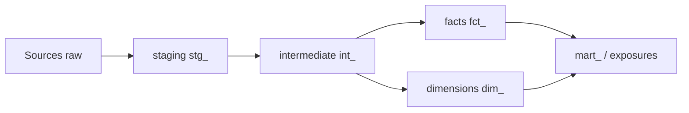

# 05 — dbt

> **Versão:** 1.0 · **Repo:** `{nome-projeto}-dbt` · **Warehouse:** conforme ambiente · **Orquestração:** Airflow + Cosmos — [04-airflow.md](04-airflow.md)

---

## Sumário

1. [Objetivo](#1-objetivo)
2. [Público-alvo](#2-público-alvo)
3. [Problemas comuns](#3-problemas-comuns)
4. [Princípios](#4-princípios)
5. [Decisões](#5-decisões)
6. [Trade-offs](#6-trade-offs)
7. [Quando usar / não usar dbt](#7-quando-usar--não-usar-dbt)
8. [Estrutura de pastas](#8-estrutura-de-pastas)
9. [Camadas de modelagem](#9-camadas-de-modelagem)
10. [Convenções](#10-convenções)
11. [Práticas obrigatórias e recomendadas](#11-práticas-obrigatórias-e-recomendadas)
12. [Anti-padrões](#12-anti-padrões)
13. [Exemplos bom / ruim](#13-exemplos-bom--ruim)
14. [Código de referência](#14-código-de-referência)
15. [Integração Airflow e contratos](#15-integração-airflow-e-contratos)
16. [Estratégias transversais](#16-estratégias-transversais)
17. [Checklists](#17-checklists)
18. [Critérios de aceite](#18-critérios-de-aceite)
19. [Definition of Done](#19-definition-of-done)
20. [FAQ](#20-faq)
21. [Guia júnior](#21-guia-júnior)
22. [Guia sênior](#22-guia-sênior)

---

## 1. Objetivo

Padronizar **transformação analítica** com dbt no repositório `{nome-projeto}-dbt`: modelos em camadas testáveis, documentados, com lineage claro, materialização adequada ao volume, integração com Airflow e qualidade observável no **Datadog**.

**Regra de ouro:** staging espelha e limpa a fonte; marts respondem perguntas de negócio; **nenhum consumidor** deve depender de tabelas staging em produção analítica.

---

## 2. Público-alvo

Engenheiros de analytics engineering, revisores de PR SQL, consumidores de marts (BI, APIs), operação que responde a falhas de `dbt test` e freshness.

---

## 3. Problemas comuns

| Problema | Sintoma | Impacto |
|----------|---------|---------|
| Mart sem teste | Dashboard com dado errado | Decisão de negócio incorreta |
| `select *` em produção | Custo e quebra de schema | Scan caro, pipeline frágil |
| Lógica de negócio só no BI | Métricas divergentes | Uma verdade por ferramenta |
| Incremental mal definido | Duplicata ou perda | Reprocessamento manual |
| Staging exposto | Dashboard acoplado a raw | Mudança fonte quebra tudo |
| Sem freshness | Dado stale silencioso | SLA perdido |
| Macro opaca | Ninguém entende SQL gerado | Review impossível |

---

## 4. Princípios

### DBT1 — Camadas com responsabilidade única

staging → intermediate → marts (e opcional exports).

### DBT2 — Um model, um conceito

Facilita teste, documentação e ownership.

### DBT3 — Contratos na borda

`sources.yml` com freshness; data contracts em marts críticos.

### DBT4 — SQL legível > clever

CTEs nomeadas; evitar mega CASE aninhado sem intermediate.

### DBT5 — Testes como especificação

`not_null`, `unique`, `relationships`, testes customizados e unit tests.

### DBT6 — Idempotência incremental

`unique_key`, estratégia merge/delete+insert documentada, `lookback_days` para late data.

### DBT7 — Documentação no YAML

Descrição em model e colunas; exposures para downstream.

### DBT8 — Observabilidade

Logs/métricas de run via Airflow → Datadog; falha de teste = alerta.

---

## 5. Decisões

| ID | Decisão | Detalhe |
|----|---------|---------|
| DBT-D01 | Prefixos `stg_`, `int_`, `fct_`, `dim_`, `mart_` | Ver seção 9 |
| DBT-D02 | Materialização incremental para fatos grandes | merge ou delete+insert |
| DBT-D03 | `on_schema_change: append_new_columns` default incremental | Evitar falha silenciosa |
| DBT-D04 | Unit tests dbt 1.8+ para lógica complexa | YAML em `models/` |
| DBT-D05 | Tags `{nome-projeto}` + domínio | Seleção Airflow/Cosmos |
| DBT-D06 | Vars `data_referencia`, `lookback_days` | Alinhado Airflow `{{ ds }}` |
| DBT-D07 | Exposures para dashboards críticos | Lineage até consumo |
| DBT-D08 | Contract enforced em marts publicados | Breaking = versionar |

---

## 6. Trade-offs

### 6.1 View vs. table vs. incremental

| view | table | incremental |
|------|-------|-------------|
| Barato refresh | Rebuild completo | Merge custo médio |
| Staging leve | Mart pequeno | Fato alto volume |

### 6.2 Intermediate vs. lógica no mart

| Intermediate | Tudo no mart |
|--------------|--------------|
| Reuso, teste isolado | Menos arquivos |
| Mais refs | Duplicação |

**Regra:** join usado em ≥ 2 marts → `int_`.

### 6.3 Ephemeral vs. view

Ephemeral para CTE compartilhada **não exposta**; view quando debug time precisa inspecionar.

### 6.4 Teste no warehouse vs. unit test

Unit test para lógica pura; integration test (`dbt build`) para contrato real.

---

## 7. Quando usar / não usar dbt

### Use dbt quando

- Transformações SQL no warehouse (Redshift, BigQuery, Snowflake, Databricks SQL, Athena)
- Necessidade de testes, docs e lineage
- Múltiplos consumidores dos mesmos marts
- Pipeline batch após landing Glue/S3

### Não use dbt quando

- Transformação pesada pré-warehouse (use Glue) — dbt consome resultado
- Latência streaming (fora padrão batch)
- Lógica procedural complexa sem equivalente SQL claro (avalie Python no Glue + staging simples)

---

## 8. Estrutura de pastas

```
{nome-projeto}-dbt/
├── README.md
├── dbt_project.yml
├── packages.yml
├── models/
│   ├── staging/
│   │   └── {fonte}/
│   │       ├── _sources.yml
│   │       └── stg_{fonte}__{entidade}.sql
│   ├── intermediate/
│   │   └── {dominio}/
│   │       └── int_{dominio}__{descricao}.sql
│   ├── marts/
│   │   └── {dominio}/
│   │       ├── fct_{dominio}_{evento}.sql
│   │       ├── dim_{dominio}_{entidade}.sql
│   │       └── _schema.yml
│   └── exports/                    # opcional: views para APIs
├── snapshots/
│   └── snp_{entidade}.sql
├── seeds/
├── tests/                          # data tests genéricos
├── macros/
├── analyses/
└── docs/
    └── runbooks/
```

---

## Padrões de código da stack

Índice rápido — detalhes neste capítulo:

| Tópico | Seção |
|--------|-------|
| Estrutura de pastas | [§8](#8-estrutura-de-pastas) |
| Camadas e convenções | [§9](#9-camadas-de-modelagem) · [§10](#10-convenções) |
| Práticas e anti-padrões | [§11](#11-práticas-obrigatórias-e-recomendadas) · [§12](#12-anti-padrões) |
| Exemplos | [§13](#13-exemplos-bom--ruim) |
| Checklists | [§17](#17-checklists) |
| Logging seguro | [13 — Observabilidade](13-observabilidade.md#logging-seguro-e-dados-sensíveis) |

Transversal: [03 — Padrões de código](03-padroes-de-codigo.md) · [18 — DoD](18-definition-of-done.md)

---

## 9. Camadas de modelagem

| Camada | Prefixo | Propósito | Materialização típica |
|--------|---------|-----------|------------------------|
| sources | `source()` | Contrato com origem | — |
| staging | `stg_` | Limpar, renomear, tipar | view |
| intermediate | `int_` | Joins, regras reutilizáveis | view ou ephemeral |
| marts | `fct_`, `dim_`, `mart_` | Negócio | table / incremental |
| snapshots | `snp_` | SCD tipo 2 | snapshot |
| exports | `exp_` | Borda para API/BI | view |

**Fluxo:**



---

## 10. Convenções

### 10.1 Naming de arquivos e models

| Tipo | Padrão | Exemplo |
|------|--------|---------|
| Staging | `stg_{fonte}__{entidade}.sql` | `stg_{nome-projeto}__arquivos_recebidos.sql` |
| Intermediate | `int_{dominio}_{descricao}.sql` | `int_{nome-projeto}__arquivos_validados.sql` |
| Fact | `fct_{dominio}_{evento}.sql` | `fct_{nome-projeto}_processamentos.sql` |
| Dim | `dim_{dominio}_{entidade}.sql` | `dim_{nome-projeto}_tipo_arquivo.sql` |
| Mart | `mart_{dominio}_{uso}.sql` | `mart_{nome-projeto}_acompanhamento_processamento.sql` |

Duplo underscore `__` separa fonte/domínio de entidade. **Models internos** usam nomes em português após o prefixo técnico (`stg_`, `int_`, etc.).

### 10.2 Colunas

- snake_case
- Chaves: `{entidade}_id`
- Datas: `{evento}_at` ou `data_{evento}`
- Booleanos: `is_` / `has_`
- Surrogate key documentada se diferente de natural key

### 10.3 Tags

```yaml
# dbt_project.yml
models:
  {nome_projeto}_dbt:
    marts:
      vendas:
        +tags: ["datalake", "vendas", "critical"]
```

---

## 11. Práticas obrigatórias e recomendadas

### Obrigatórias

1. `_schema.yml` por pasta de mart com descrição e testes em colunas críticas
2. `dbt build` verde no CI antes de merge
3. Incremental com `unique_key` e estratégia documentada no model
4. Sources com freshness em origens com SLA
5. Sem PII desnecessária em marts — mascarar/hash — [17-seguranca-conformidade-e-dados-sensiveis.md](17-seguranca-conformidade-e-dados-sensiveis.md)
6. Vars `data_referencia` alinhadas ao Airflow
7. Impacto downstream avaliado (exposures, lineage)

### Recomendadas

1. Unit tests para lógica CASE/janela complexa
2. Data contracts enforced em marts publicados
3. `dbt docs generate` publicado em portal interno
4. Métrica Datadog de duração e falha por tag
5. Dicionário de dados para marts críticos — [15-documentacao.md](15-documentacao.md)
6. `lookback_days` para late arriving data

---

## 12. Anti-padrões

| Anti-padrão | Correção |
|-------------|----------|
| Join de 8 tabelas no mart | Quebrar em `int_` |
| `select *` em staging produção | Listar colunas |
| Mart lendo source direto | Passar por staging |
| Incremental sem unique_key | Adicionar chave + merge |
| Teste só `not_null` em tudo | Testes de regra de negócio |
| Macro de 200 linhas | SQL explícito ou intermediate |
| Hardcode data `'2020-01-01'` | `var('data_corte')` |
| Duplicar grain em dois fcts | Documentar ou unificar |

---

## 13. Exemplos bom / ruim

### 13.1 Staging

**Ruim:**

```sql
-- stg_vendas_pedidos.sql
select * from raw.pedidos
```

**Bom:**

```sql
-- models/staging/vendas/stg_vendas__pedidos.sql
-- Por quê: tipagem e padronização na borda; sem join de negócio aqui.
with source as (
    select * from {{ source('vendas_raw', 'pedidos') }}
),
renamed as (
    select
        cast(id_pedido as varchar) as pedido_id,
        cast(data_pedido as date) as data_pedido,
        upper(trim(status)) as status,
        cast(valor as decimal(18, 2)) as valor,
        cast(updated_at as timestamp) as updated_at
    from source
    where data_pedido >= {{ var('data_corte', '2020-01-01') }}
)
select * from renamed
```

### 13.2 Incremental

**Ruim:**

```sql
{{ config(materialized='incremental') }}
select * from {{ ref('int_vendas__pedidos') }}
-- sem filtro incremental, sem unique_key
```

**Bom:**

```sql
-- models/marts/vendas/fct_vendas_pedidos.sql
{{
  config(
    materialized='incremental',
    unique_key='pedido_id',
    incremental_strategy='merge',
    on_schema_change='append_new_columns',
    tags=['datalake', 'vendas']
  )
}}
select * from {{ ref('int_vendas__pedidos_enriquecidos') }}

where updated_at > (
    select coalesce(max(updated_at), '1900-01-01'::timestamp)
    from {{ this }}
)

```

### 13.3 schema.yml

**Ruim:** model sem descrição, sem testes em `pedido_id`.

**Bom:**

```yaml
version: 2
models:
  - name: fct_vendas_pedidos
    description: >
      Um registro por pedido aprovado ou cancelado.
      Grain: pedido_id. Atualização incremental diária.
    columns:
      - name: pedido_id
        description: Identificador natural do pedido na origem.
        tests: [not_null, unique]
      - name: status
        tests:
          - accepted_values:
              values: ['APROVADO', 'CANCELADO', 'PENDENTE']
      - name: valor
        tests: [not_null]
      - name: valor
        description: Valor monetário em BRL.
```

---

## 14. Código de referência

### 14.1 sources.yml com freshness

```yaml
version: 2
sources:
  - name: vendas_raw
    database: "{{ var('raw_database') }}"
    schema: landing
    tables:
      - name: pedidos
        loaded_at_field: _ingested_at
        freshness:
          warn_after: { count: 12, period: hour }
          error_after: { count: 24, period: hour }
        columns:
          - name: id_pedido
            tests: [not_null]
```

### 14.2 Intermediate

```sql
-- models/intermediate/vendas/int_vendas__pedidos_enriquecidos.sql
with pedidos as (
    select * from {{ ref('stg_vendas__pedidos') }}
),
clientes as (
    select * from {{ ref('stg_vendas__clientes') }}
),
joined as (
    select
        p.pedido_id,
        p.data_pedido,
        p.status,
        p.valor,
        p.updated_at,
        c.segmento_cliente,
        c.is_vip
    from pedidos p
    left join clientes c on p.cliente_id = c.cliente_id
)
select * from joined
```

### 14.3 Teste customizado (valor não negativo)

```sql
-- tests/assert_fct_vendas_valor_nao_negativo.sql
select pedido_id, valor
from {{ ref('fct_vendas_pedidos') }}
where valor < 0
```

### 14.4 Unit test (dbt 1.8+)

```yaml
# models/intermediate/vendas/unit_tests/int_vendas__status_normalizado.yml
unit_tests:
  - name: test_status_uppercase
    model: int_vendas__status_normalizado
    given:
      - input: ref('stg_vendas__pedidos')
        rows:
          - { pedido_id: '1', status: 'aprovado' }
    expect:
      rows:
        - { pedido_id: '1', status: 'APROVADO' }
```

### 14.5 Data contract

```yaml
models:
  - name: fct_vendas_pedidos
    config:
      contract:
        enforced: true
    columns:
      - name: pedido_id
        data_type: varchar
        constraints: [not_null]
      - name: valor
        data_type: decimal(18,2)
```

### 14.6 Exposures

```yaml
exposures:
  - name: dashboard_vendas_executivo
    type: dashboard
    maturity: high
    url: https://bi.internal/dashboards/vendas
    depends_on:
      - ref('fct_vendas_pedidos')
      - ref('dim_vendas_cliente')
    owner:
      name: time_analytics
      email: analytics@{empresa}.com
```

### 14.7 vars e lookback

```yaml
# dbt_project.yml
vars:
  data_corte: '2020-01-01'
  lookback_days: 3
```

```sql

where data_pedido >= dateadd(
    day, -{{ var('lookback_days', 3) }},
    to_date('{{ var("data_referencia") }}')
)

```

### 14.8 Engine-specific (ajustar ao warehouse)

| Engine | Config exemplo |
|--------|----------------|
| BigQuery | `partition_by: { field: data_pedido, data_type: date }` |
| Redshift | `dist`, `sort` em config |
| Snowflake | `cluster_by` |
| Athena/Iceberg | `table_type`, `partitioned_by` |

---

## 15. Integração Airflow e contratos

### Comando padrão (Cosmos preferido)

```bash
dbt deps
dbt build --select tag:vendas --vars '{"data_referencia": "{{ ds }}", "correlation_id": "{{ run_id }}"}'
```

Orquestrar **após** dados em staging (sensor S3, Dataset ou task Glue).

### Contrato com Glue

Glue escreve em `landing` ou tabela external; dbt `source()` aponta para lá. Mudança de schema → `schema_version` + ADR.

Ver [04-airflow.md](04-airflow.md) e [02-arquitetura-transversal.md](02-arquitetura-transversal.md).

---

## 16. Estratégias transversais

### Testes

| Tipo | Uso |
|------|-----|
| Schema tests | not_null, unique, relationships |
| `dbt_utils` | `expression_is_true`, `equal_rowcount` |
| Custom data tests | Regras SQL específicas |
| Unit tests | Lógica em fixture |
| Freshness | SLA origem |

CI: `dbt build --select state:modified+` em PR quando artefato de estado disponível.

[10-testes-unitarios.md](10-testes-unitarios.md)

### Observabilidade (Datadog)

- Airflow/Cosmos envia status de task dbt
- Log estruturado com `correlation_id`, `models_selected`, `duration`
- Métricas: `dbt.run.success`, `dbt.test.failure`, `dbt.freshness.error`
- Alerta em falha de teste em mart `critical` tag

[13-observabilidade.md](13-observabilidade.md)

### Performance

- Filtrar cedo no staging (`where data_pedido`)
- Evitar cross join
- Incremental em fatos grandes
- Medir bytes scanned no CI (BigQuery) ou explain

[14-performance.md](14-performance.md)

### Segurança

- Marts sem colunas PII não necessárias
- Row access policies no warehouse quando aplicável
- Mascaramento em staging se origem contém PII

[17-seguranca-conformidade-e-dados-sensiveis.md](17-seguranca-conformidade-e-dados-sensiveis.md)

### Documentação

- Descrição em todo mart público
- Dicionário para `critical` marts
- ADR para mudança incremental strategy

[15-documentacao.md](15-documentacao.md)

---

## 17. Checklists

### 17.1 Implementação

- [ ] Model na camada correta com prefixo
- [ ] `_schema.yml` atualizado
- [ ] Testes em chaves e regras de negócio
- [ ] Materialização adequada ao volume
- [ ] Incremental documentado se aplicável
- [ ] Tags para seleção Airflow
- [ ] `dbt build` local/staging verde
- [ ] Lineage/exposures se consumidor novo

### 17.2 Code review

- [ ] Grain do fct explícito?
- [ ] Sem `select *`?
- [ ] Join apenas em int/mart?
- [ ] Impacto downstream?
- [ ] PII tratada?
- [ ] [16-code-review.md](16-code-review.md)

### 17.3 Operação

- [ ] Freshness configurado
- [ ] Runbook falha dbt test
- [ ] Procedimento backfill com vars
- [ ] Dashboard qualidade dados

---

## 18. Critérios de aceite

- [ ] `dbt build` completo verde em staging
- [ ] Testes cobrem grain e regras críticas
- [ ] Freshness dentro do SLA em ambiente representativo
- [ ] Documentação YAML suficiente para consumidor self-service
- [ ] Sem breaking contract sem versionamento

---

## 19. Definition of Done

[18-definition-of-done.md](18-definition-of-done.md) + dbt:

- [ ] CI dbt verde
- [ ] schema.yml completo
- [ ] Exposures atualizadas se dashboard afetado
- [ ] Dicionário se mart critical
- [ ] Monitor Datadog se tag critical
- [ ] PR referencia [05-dbt.md](05-dbt.md)

---

## 20. FAQ

**P: Posso materializar staging como table?**  
R: Sim se view for lenta; documentar custo de refresh.

**P: Quantos models por PR?**  
R: Preferir PRs focados; refator grande exige plano e `state:modified+` no CI.

**P: dbt roda em dev sem warehouse?**  
R: Usar target dev com dados mascarados; não skip testes.

**P: Snapshot vs. slowly changing dim?**  
R: Snapshot dbt para histórico; `dim_` type 1/2 conforme ADR.

**P: Falhou teste unique após incremental?**  
R: Verificar unique_key, duplicata na origem, lookback insuficiente.

---

## 21. Guia júnior

Desenhe o **grain** do fato em uma frase antes de escrever SQL. Escreva `schema.yml` junto com o model, não depois. Rode `dbt build --select +meu_model` para validar downstream.

---

## 22. Guia sênior

Impeça mart que bypassa staging — dívida sempre cobrada. Exija contract enforced antes de expor para API externa. Calibre `lookback_days` com dados reais de atraso. Qualidade de dados é produto: conecte testes dbt a SLO de negócio no Datadog.

---

*Anterior:* [04 — Airflow](04-airflow.md) · *Próximo:* [06 — Terraform](06-terraform.md)
