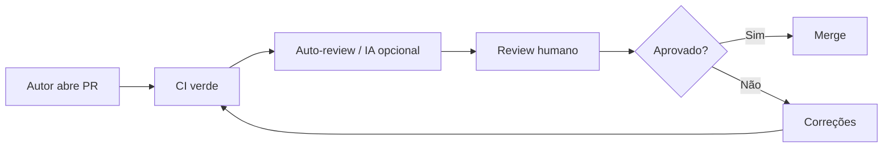

# 16 — Code Review

Code review é **gate de qualidade** antes do merge — não cerimônia nem rubber stamp.

**Regra:** todo PR em repositório de código exige aprovação de **pelo menos um humano** que entenda o domínio e a stack.

---

## 1. Objetivo

Garantir, antes do merge:

- **Correção** funcional e de dados
- **Segurança** e conformidade
- **Operabilidade** (observabilidade, runbook, rollback)
- **Aderência** aos padrões do [Engineering Handbook](.)
- **Contratos** preservados ou breaking change explícito

---

## 2. Dimensões do review

| Dimensão | Pergunta central |
|----------|------------------|
| **Funcional** | Faz o que deveria nos casos limite e de borda? |
| **Clareza** | Outro dev entende em 15 min sem oral? |
| **Nomenclatura** | Identificadores internos em português conforme [03](03-padroes-de-codigo.md#92-nomenclatura-de-código-em-português)? |
| **Testes** | ≥ 90% cobertura + casos relevantes + mutation/TaaC onde aplicável? |
| **Segurança** | Least privilege, sem segredo, input validado, sem PII em log? |
| **Performance** | Aguenta volume esperado e 10× sem surpresa? |
| **Observabilidade** | Dá para debugar em prod com `correlation_id` no Datadog? |
| **Dados** | Impacto em schema, backfill, qualidade, idempotência? |
| **Ops** | Rollback, alerta, runbook, reprocessamento? |
| **Contratos** | Breaking change explícito com migração? |
| **Feature flags** | Rollout, default e rollback documentados? |
| **Multi-repo** | PRs irmãos referenciados? Contrato alinhado? |

---

## 3. Fluxo recomendado

1. Autor preenche template [`templates/pr.md`](templates/pr.md).
2. CI deve estar **verde** (lint, testes, coverage, scans).
3. IA pode **pré-revisar** (skill `revisar-codigo`) — não substitui humano.
4. Revisor usa checklist da stack + dimensões acima.
5. Comentários com severidade clara (§5).
6. Aprovação explícita; merge só com DoD atendida.

---

## 4. Código gerado por IA — atenção redobrada

- [ ] Dependências existem no `pyproject.toml` / `pom.xml` / `requirements.txt`?
- [ ] Regra de negócio **não foi inventada** — confirmar com spec/ADR?
- [ ] Testes assertam **comportamento**, não só `assert True`?
- [ ] Erros não são `except Exception: pass`?
- [ ] Segue padrões do **módulo vizinho**, não estilo genérico da IA?
- [ ] Sem dependência ou arquivo morto “por precaução”?
- [ ] Logs e métricas seguem [13 — Observabilidade](13-observabilidade.md)?

---

## 5. Severidade de comentários

| Nível | Significado | Merge |
|-------|-------------|-------|
| 🔴 **Bloqueio** | Bug, segurança, perda de dados, contrato quebrado | Bloqueado |
| 🟡 **Atenção** | Fortemente recomendado; débito aceitável só com justificativa | Discricionário |
| 🟢 **Sugestão** | Melhoria opcional, estilo, naming | Livre |

### Exemplos

**Bloqueio:**
> Regra de cálculo no handler Lambda impede teste unitário. Extrair para `domain/` conforme [07 — Lambda Python](07-lambda-python.md).

**Atenção:**
> Incremental dbt sem `unique_key` documentado — risco de duplicata em reprocessamento.

**Sugestão:**
> Considerar renomear `process_data` para `normalizar_pedidos_vendas`.

---

## 6. Checklist por stack

### 6.1 Airflow

- [ ] Zero I/O no parse da DAG
- [ ] `doc_md` com SLA e idempotência
- [ ] Callback de falha com log JSON + métrica
- [ ] `max_active_runs` adequado
- [ ] Sensors com `reschedule` quando longos
- [ ] `correlation_id` propagado

### 6.2 dbt

- [ ] `schema.yml` com descriptions
- [ ] Incremental com `unique_key` e filtro
- [ ] Tests em colunas críticas
- [ ] `dbt build` verde
- [ ] Impacto em downstream (`exposures`)

### 6.3 Terraform

- [ ] `plan` anexado ou na CI
- [ ] IAM least privilege — sem `*` sem ADR
- [ ] Tags `env`, `service`, `team`
- [ ] Alarmes em recursos críticos
- [ ] tfsec/checkov sem falha bloqueante

### 6.4 Lambda Python

- [ ] Handler fino; lógica em `domain/`
- [ ] Powertools: logs, métricas, trace
- [ ] DLQ se async
- [ ] Timeout e idempotência
- [ ] Cobertura ≥ 90%

### 6.5 Java Spring Boot

- [ ] OpenAPI atualizado
- [ ] Sem N+1; paginação em listagens
- [ ] MDC `correlation_id`
- [ ] Testes slice/integração em endpoints novos
- [ ] Sem segredo em `application.yml`

### 6.6 Glue

- [ ] Transform testável (funções puras extraídas)
- [ ] Particionamento de saída
- [ ] Sem collect massivo
- [ ] Job args documentados
- [ ] Métricas de volume/duração

### 6.7 Testes (transversal)

- [ ] Cobertura ≥ 90% (justificativa se menor)
- [ ] Mutation ≥ 90% em domain/application
- [ ] TaaC se integração real
- [ ] Nomes descritivos; asserts de comportamento

### 6.8 Observabilidade

- [ ] Log JSON + `correlation_id`
- [ ] Métricas sucesso/erro/duração/volume
- [ ] Sem PII em log
- [ ] Monitor/runbook se fluxo crítico

### 6.9 Performance

- [ ] Volume documentado
- [ ] Sem N+1 / full scan / collect
- [ ] Custo AWS considerado

### 6.10 Segurança

- [ ] Inputs validados
- [ ] Least privilege IAM
- [ ] Sem segredos no código
- [ ] Scan de dependências sem CVE crítico

---

## 7. Review em multi-repo

| Situação | O que verificar |
|----------|-----------------|
| Contrato alterado | PR correspondente no repo consumidor |
| Output Terraform | README do serviço atualizado |
| Schema dbt / API | Comunicação e versão |
| Ordem de deploy | Plano de implementação com sequência |

Cada PR deve ser **revisável isoladamente**, com links para os irmãos.

---

## 8. Papéis

| Papel | Responsabilidade |
|-------|------------------|
| **Autor** | PR completo, CI verde, responder comentários em 1 dia útil |
| **Revisor** | Review em 1–2 dias úteis; severidade clara; aprovar só com DoD |
| **Tech lead** | Breaking changes, exceções de DoD, conflito de prioridade |
| **Dono do domínio** | Regras de negócio e impacto em dados |

---

## 9. Ferramentas

| Ferramenta | Uso |
|------------|-----|
| Template PR | [`templates/pr.md`](templates/pr.md) |
| Registro de review | [`templates/code-review.md`](templates/code-review.md) |
| Skill IA | `revisar-codigo` (derivada deste capítulo) |
| DoD | [18 — Definition of Done](18-definition-of-done.md) |

---

## 10. Anti-padrões de review

| Evitar | Por quê |
|--------|---------|
| “LGTM” sem ler | Regressão em prod |
| Debate de estilo sem padrão | Ruído |
| Aprovar com CI vermelho | Merge quebrado |
| Bloquear sem alternativa | Paralisia |
| Review só de sintaxe | Perde dados, ops e segurança |

---

## 11. Referências

- [13 — Observabilidade](13-observabilidade.md)
- [14 — Performance](14-performance.md)
- [17 — Segurança](17-seguranca-conformidade-e-dados-sensiveis.md)
- [18 — Definition of Done](18-definition-of-done.md)
- [19 — Padrões para uso de IA](19-padroes-para-uso-de-ia.md)
