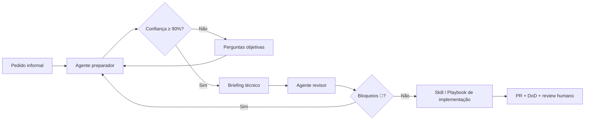

# 21 — Agentes e prompts

Este capítulo define uma **camada leve de agentes especializados** para preparar e revisar prompts antes de acionar Skills de implementação. Não substitui o handbook nem as Skills — reduz ambiguidade, limita contexto e economiza tokens.

**Princípio:** agentes **preparam e direcionam**; Skills **implementam**; humanos **aprovam merge**.

---

## 1. Por que usar agentes especializados

| Problema comum | Como o agente ajuda |
|----------------|---------------------|
| Pedido vago (“melhora o pipeline”) | Classifica tarefa, stack e escopo |
| Agente lê handbook inteiro | Indica **pacote mínimo** de capítulos/arquivos |
| Regra de negócio inventada | Separa assunções de fatos; pergunta se confiança < 90% |
| Prompt gigante | Referencia caminhos; não cola capítulos inteiros |
| Skill errada acionada | Mapeia stack → Skill/playbook correto |

Agentes **não implementam tudo**. Eles produzem **briefing técnico** ou **revisão de prompt** para a etapa seguinte.

---

## 2. Quando usar o agente preparador

Use **antes** de pedir implementação quando:

- O pedido inicial está incompleto ou ambíguo
- A tarefa pode afetar múltiplos repositórios
- Há risco de breaking change, dados sensíveis ou contrato desconhecido
- Você quer economizar tokens na execução
- Precisa direcionar Claude/Devin para a Skill correta

**Artefatos:**

| Ferramenta | Artefato |
|------------|----------|
| Claude Code | Skill [`preparar-prompt-tecnico`](../../claude/skills/preparar-prompt-tecnico/SKILL.md) |
| Devin | Playbook [`preparar-feature-para-implementacao.md`](../../devin/playbooks/preparar-feature-para-implementacao.md) |

---

## 3. Quando usar o agente revisor

Use **depois** do preparador e **antes** de mandar implementar quando:

- O prompt final parece longo ou genérico
- Não há critérios de aceite testáveis
- O prompt pede leitura excessiva de arquivos
- Há suspeita de regra de negócio inventada
- Multi-repo sem ordem de deploy definida

**Artefatos:**

| Ferramenta | Artefato |
|------------|----------|
| Claude Code | Skill [`revisar-prompt-tecnico`](../../claude/skills/revisar-prompt-tecnico/SKILL.md) |
| Devin | Playbook [`revisar-prompt-de-implementacao.md`](../../devin/playbooks/revisar-prompt-de-implementacao.md) |

---

## 4. Quando chamar uma Skill de implementação

Chame a Skill de stack **somente após**:

1. Briefing técnico aprovado (ou confiança ≥ 90%)
2. Revisão de prompt sem bloqueios 🔴
3. Contexto mínimo listado explicitamente

| Stack | Skill Claude/Devin | Capítulo handbook |
|-------|-------------------|-------------------|
| Airflow | `criar-dag-airflow` | [04 — Airflow](04-airflow.md) |
| dbt | `criar-modelo-dbt` | [05 — dbt](05-dbt.md) |
| Terraform | `criar-modulo-terraform` | [06 — Terraform](06-terraform.md) |
| Lambda Python | `criar-lambda-python` | [07 — Lambda Python](07-lambda-python.md) |
| Java Spring Boot | `criar-api-spring-boot` | [08 — Java Spring Boot](08-java-spring-boot.md) |
| AWS Glue | `criar-job-glue` | [09 — AWS Glue](09-aws-glue.md) |
| Testes | `criar-testes-unitarios` | [10 — Testes unitários](10-testes-unitarios.md) |
| TaaC | `criar-taac` | [11 — TaaC](11-taac-testes-integrados-na-pipeline.md) |
| Review | `revisar-codigo` | [16 — Code review](16-code-review.md) |
| Performance | `revisar-desempenho` | [14 — Performance](14-performance.md) |
| Observabilidade | `melhorar-observabilidade` | [13 — Observabilidade](13-observabilidade.md) |
| Incidente | `investigar-falha` | [13 — Observabilidade](13-observabilidade.md) |
| Documentação | `criar-documentacao` | [15 — Documentação](15-documentacao.md) |
| Feature ampla | — | Playbook [`implementar-feature`](../../devin/playbooks/implementar-feature.md) |

**Sempre incluir** (transversal): [03 — Padrões de código](03-padroes-de-codigo.md) e [18 — Definition of Done](18-definition-of-done.md).

---

## 5. Como economizar tokens

1. **Referenciar, não colar** — use caminhos relativos ao handbook e ao repo alvo
2. **Um capítulo de stack** — não leia 04–09 se a tarefa é só dbt
3. **README do repo alvo** — suficiente para convenções locais na fase de preparação
4. **Separar análise e implementação** — duas interações menores custam menos que uma gigante com retrabalho
5. **Uma Skill por tarefa** — não acione `criar-dag-airflow` + `criar-modelo-dbt` se o briefing é só Airflow
6. **Briefing como contrato** — o implementador lê só o que o briefing lista

---

## 6. Pacote mínimo de contexto

Monte o menor conjunto que responde:

| Pergunta | O que incluir |
|----------|---------------|
| Onde editar? | Repo(s), path(s), arquivos vizinhos de referência |
| Como editar? | Capítulo da stack + [03 — Padrões de código](03-padroes-de-codigo.md) |
| Quando está pronto? | [18 — DoD](18-definition-of-done.md) + critérios de aceite do briefing |
| Como observar? | [13 — Observabilidade](13-observabilidade.md) se fluxo novo ou crítico |
| Há risco de segurança? | [17 — Segurança](17-seguranca-conformidade-e-dados-sensiveis.md) se PII/IAM/dados sensíveis |

**Exemplo — nova DAG Airflow:**

```
README do {nome-projeto}-airflow
docs/engineering-handbook/03-padroes-de-codigo.md
docs/engineering-handbook/04-airflow.md
docs/engineering-handbook/18-definition-of-done.md
claude/skills/criar-dag-airflow/SKILL.md  (ou devin/skills/...)
dags/<modulo>/exemplo_vizinho.py            (no repo alvo)
```

---

## 7. Como lidar com ambiguidade

Sinais de ambiguidade relevante:

- Regra de negócio ausente ou contraditória
- Contrato de entrada/saída desconhecido
- Repositório ou path indefinido
- Critério de aceite ausente ou não testável
- Risco de breaking change não avaliado
- Possível exposição de dados sensíveis

**Regra:** se a ambiguidade impacta **o que** implementar ou **como** validar, **pergunte antes** de gerar prompt de implementação.

Formato de pergunta objetiva:

```
Para fechar o briefing, preciso de:
1. {pergunta específica}
2. {pergunta específica}
Opções sugeridas: A) … B) …
```

---

## 8. Como calcular confiança

Escala operacional (não estatística):

| Nível | Confiança | Ação |
|-------|-----------|------|
| **Alta** | ≥ 90% | Gerar prompt final de implementação |
| **Média** | 70–89% | Gerar briefing com **assunções explícitas**; listar o que validar com humano |
| **Baixa** | < 70% | **Perguntar** antes de prompt de implementação |

**Heurística rápida** — comece em 100% e subtraia:

| Fator ausente ou incerto | Penalidade |
|--------------------------|------------|
| Repositório alvo | −25% |
| Stack principal | −20% |
| Entrada/saída do fluxo | −20% |
| Critério de aceite testável | −15% |
| Contrato externo desconhecido | −15% |
| Regra de negócio não documentada | −20% |
| Multi-repo sem ordem de deploy | −10% |
| Risco dados sensíveis não avaliado | −15% |

Se resultado < 90%, **não** gere prompt de implementação sem perguntas ou assunções explícitas (média).

---

## 9. Separar prompt de análise e prompt de implementação

| Fase | Objetivo | Output |
|------|----------|--------|
| **Análise** (preparador) | Entender, classificar, delimitar | Briefing técnico |
| **Revisão** (revisor) | Validar briefing/prompt | Lista 🔴🟡🟢 |
| **Implementação** (Skill) | Editar código com contexto mínimo | PR + evidências DoD |

Não misture “descubra o que fazer” com “implemente agora” no mesmo prompt — aumenta leitura desnecessária e retrabalho.

---

## 10. Evitar leitura do handbook inteiro

> **Nunca peça para o agente ler todo o handbook se a tarefa envolver apenas uma stack.**
> **Sempre indique o menor conjunto de capítulos necessário.**

| Tarefa | Leitura suficiente |
|--------|-------------------|
| Nova DAG | 03, 04, 18 (+ 13 se crítica) |
| Model dbt | 03, 05, 18 |
| Lambda | 03, 07, 18 (+ 17 se auth/dados) |
| Feature multi-repo | 03, 02, 18 + capítulo de cada stack tocada |
| Review de PR | 03, 16, 18 + capítulo da stack |

O preparador deve listar esses caminhos no briefing — nunca “leia `docs/engineering-handbook/`”.

---

## 11. Fluxo recomendado



---

## 12. Nomenclatura e contratos externos

- Identificadores **internos** novos em **português** ([03 — Padrões de código](03-padroes-de-codigo.md))
- Preservar nomes de SDKs, frameworks, comandos, tags Datadog (`service`, `env`, `correlation_id`) e contratos públicos existentes
- O briefing deve lembrar essa regra no prompt final — não repetir o capítulo inteiro

---

## 13. Relação com outros capítulos

| Capítulo | Relação |
|----------|---------|
| [19 — Padrões para uso de IA](19-padroes-para-uso-de-ia.md) | Hierarquia de contexto e templates de prompt |
| [18 — Definition of Done](18-definition-of-done.md) | Critérios de aceite do briefing |
| [03 — Padrões de código](03-padroes-de-codigo.md) | Nomenclatura transversal |
| [artefatos-ia.md](artefatos-ia.md) | Mapa handbook → Skills/playbooks |

---

## Fonte de verdade

Este capítulo é parte do Manual de Engenharia. Skills e playbooks de agentes são derivados — atualize o handbook antes de alterar comportamento dos agentes.
