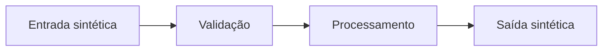

# Fluxo funcional — {nome do fluxo}

- **Owner:** {time/pessoa}
- **Última revisão:** YYYY-MM-DD

## Visão geral

{1 parágrafo: o que o fluxo faz, quem se beneficia, quando roda.}

## Diagrama

## Passo a passo

| Passo | Quem/O quê | Entrada | Ação | Saída | Observações |
|-------|------------|---------|------|-------|-------------|
| 1 | {ator} | {entrada sintética} | {ação} | {saída sintética} | {notas} |
| 2 | {ator} | ... | ... | ... | ... |

## Estados possíveis

| Estado | Significado |
|--------|-------------|
| `RECEBIDO` | Entrada registrada, aguardando validação |
| `PROCESSADO` | Fluxo concluído com sucesso |
| `REJEITADO` | Falha de validação ou regra de negócio |

## Transições

| De | Para | Gatilho |
|----|------|---------|
| `RECEBIDO` | `PROCESSADO` | Validação OK e processamento concluído |
| `RECEBIDO` | `REJEITADO` | Regra RF-XX violada |

## Exceções

| Exceção | Passo afetado | Tratamento |
|---------|---------------|------------|
| {arquivo vazio} | 1 | Rejeitar com motivo estável |

## Pontos de auditoria

| Ponto | O que registrar | O que **não** registrar |
|-------|-----------------|------------------------|
| Início do fluxo | `correlation_id`, `operation`, `status` | Payload, PII |
| Fim do fluxo | `record_count`, `duration_ms` | Conteúdo dos registros |

## Dados sensíveis

- {quais dados do fluxo são sensíveis}
- Documentar com classificação e cuidados; exemplos apenas sintéticos
- Alinhar com [Logging seguro](../13-observabilidade.md#logging-seguro-e-dados-sensíveis)

## Dúvidas abertas

- {passo ou regra a validar com humano}

## Owner

{time/pessoa}

## Última revisão

YYYY-MM-DD
