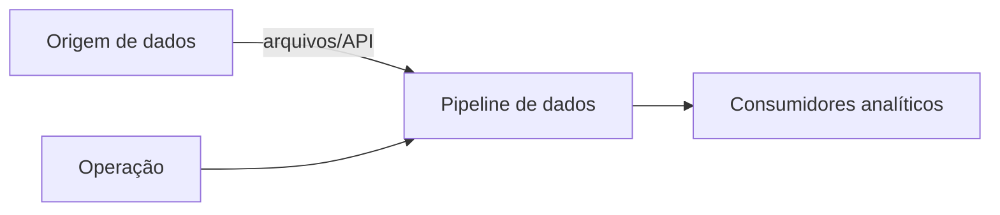
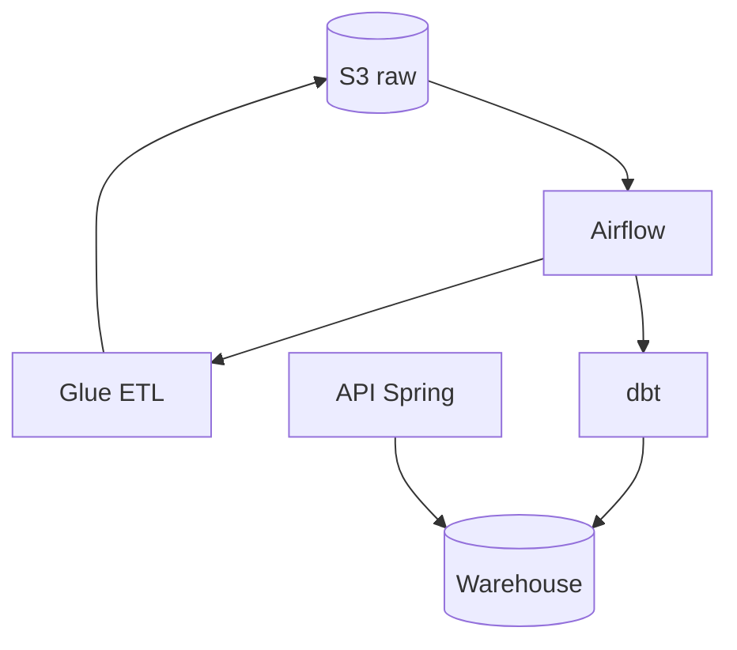

# Template: Diagrama C4 — {nome do fluxo}

Use Mermaid ou ferramenta do time. Níveis mínimos: **Contexto** e **Container**.

## Nível 1 — Contexto

## Nível 2 — Container

## Componentes

| Container | Responsabilidade | Repo/pasta |
|-----------|------------------|------------|
| Airflow | Orquestração, SLA | `airflow/` |
| Glue | Transformação batch | `glue/jobs/` |
| dbt | Modelagem analítica | `dbt/` |
| Lambda | Eventos leves | `lambdas/` |

## Contratos críticos

| De | Para | Contrato |
|----|------|----------|
| Origem | S3 | Schema arquivo, particionamento |
| Glue | S3 curated | Parquet, `data_referencia` |
| dbt | Warehouse | Models documentados em schema.yml |

## Decisões relacionadas

- ADRs: `docs/adr/`

## Manutenção

Atualizar quando adicionar/remover container ou mudar contrato público.
